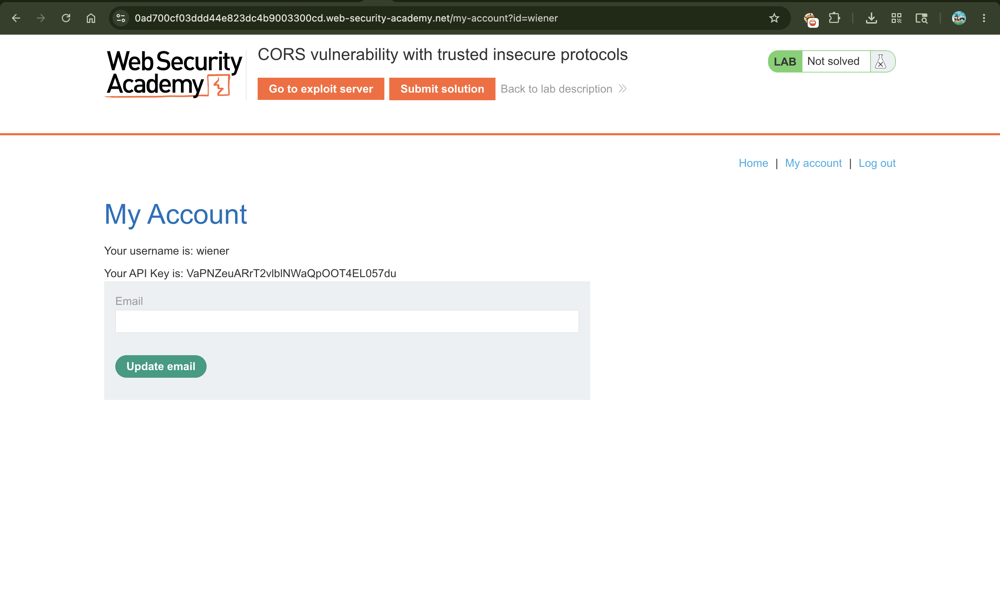
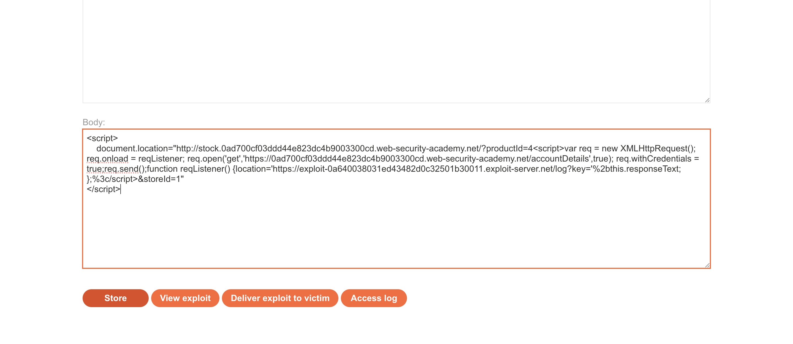
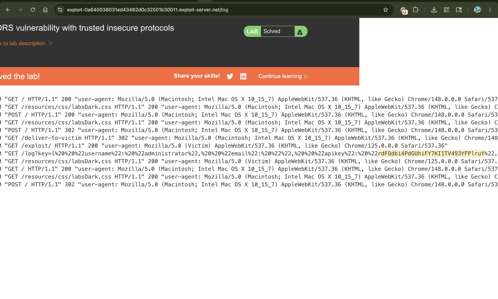

# Lab: CORS vulnerability with trusted insecure protocols

## 📌 Summary

The website's server has a lazy security rule: it trusts any subdomain, even if it uses insecure HTTP instead of secure HTTPS (e.g., `http://stock.vulnerable-site.com`).

An attacker can find an XSS vulnerability on that weak HTTP subdomain, inject a data-stealing script there, and bypass CORS. Since the main server trusts the subdomain, the script successfully steals the logged-in administrator's API key.

---

## 🧾 Description

### The Flaw: Loose Trust on Subdomains

The main secure website (`https://vulnerable-site.com`) allows cross-origin requests from its subdomains. However, the developers forgot to enforce HTTPS. This means the server blindly trusts `http://stock.vulnerable-site.com`.

### The Exploit Concept (How it plays out)

We cannot steal data directly from our own domain because the server will block us.

But, we find that the trusted `http://stock...` subdomain has an XSS flaw (in its stock checker feature).

We send a link to the victim. When they click it, they get redirected to the subdomain, and our hidden script injects into that page.

Because the script is running inside a trusted subdomain, the main website happily hands over the logged-in victim's private account details.

---

## 🔁 Steps to Reproduce

### 1. Log In to the App

Log into your account using `wiener:peter`. This makes sure you have an active session cookie in your browser.

---

### 2. Spot the Weak Subdomain

Look at the product pages and use the stock checker. Notice that it runs on an unencrypted HTTP subdomain:

http://stock.YOUR-LAB-ID.web-security-academy.net

It takes a parameter (`storeId`) and reflects it without cleaning it, meaning it is vulnerable to XSS.

---

### 3. Set Up the Exploit Payload

Go to your Exploit Server and paste this short script into the Body section (Change `YOUR-LAB-ID` and `YOUR-EXPLOIT-SERVER-ID` to match yours):

---

### 4. How This Works (Simple Breakdown)

#### The Redirect

The moment the victim opens our link, `document.location` kicks them over to the target's vulnerable HTTP stock subdomain.

#### The XSS Attack

The URL contains our data-stealing JavaScript. Because of the XSS flaw on the stock checker, the subdomain runs our code.

#### The Easy Theft

The script sends a request to `/accountDetails` to read the user profile. Since `withCredentials = true` is active, the browser attaches the victim's login cookies automatically.

#### The Bribe

The main server checks the request origin, sees it is coming from its own `http://stock` subdomain, and says, "Okay, I trust you!" It releases the data, and our script sends it straight to our exploit server's logs.

---

### 5. Deliver to Victim

Click **Deliver exploit to victim**. The administrator will view your link, and their API key will be stolen silently.

---

### 6. Submit the Key

Click **Access log** on your exploit server. Look at the web lines, find the administrator's stolen data in the URL parameter, copy the API key, and submit it to solve the lab.

---
## 📸 Proof of Concept (PoC)

### 1. Logging In

### 2. Setting up the Sandboxed Iframe Script

### 3. Submitting the Key to Complete the Lab

---

## 💥 Impact

* **HTTPS Defeat:** Attackers can bypass secure HTTPS protections just by finding one weak, outdated HTTP subdomain.

* **Full Account Takeover:** Stealing API keys gives an attacker complete control over user data and admin panels.

---

## 🛠️ Remediation

* **Enforce HTTPS Everywhere:** Never trust an origin that starts with `http://` if your main site uses `https://`.

* **Stop Dynamic Reflection:** Match origins exactly (e.g., allow `https://trusted.com`, do not use loose rules that accept any random variation).

* **Fix XSS Flaws:** Secure your input fields on all subdomains so malicious code cannot be executed.

